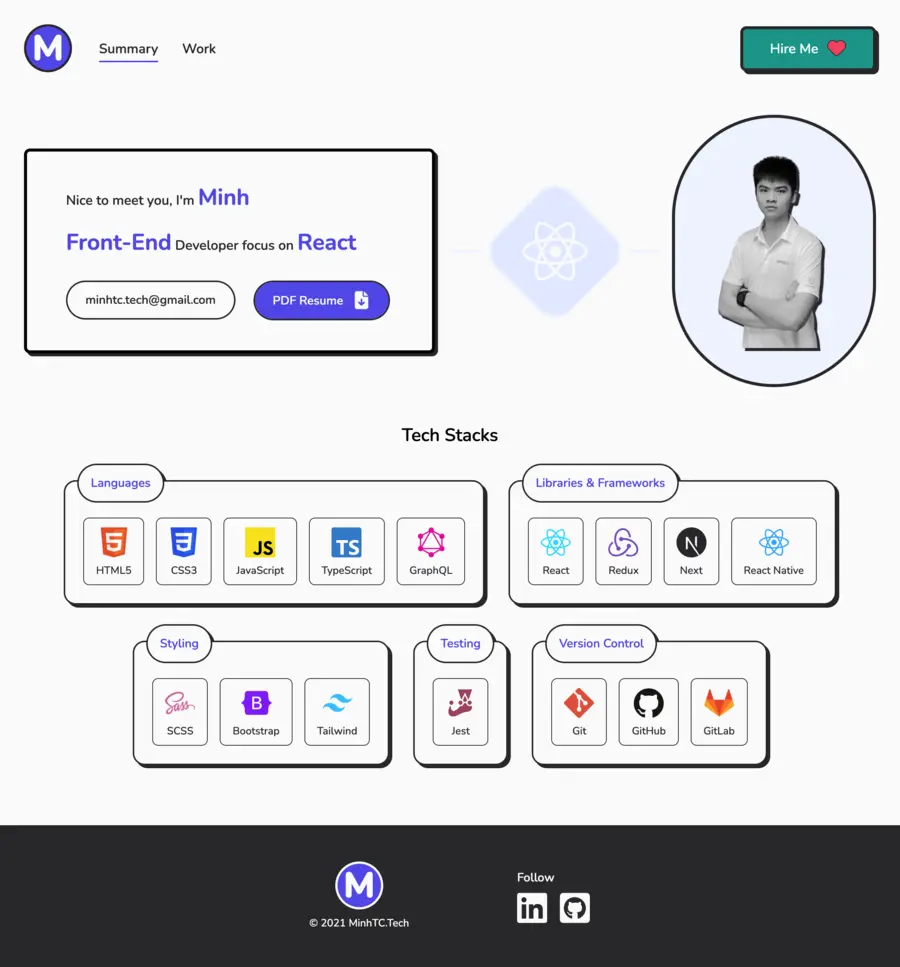

# MinhTC.Tech Portfolio



- This is my personal portfolio website built with Next.js and Tailwind CSS. It showcases my skills, projects, and experience as a front-end developer.
- Please give this source a star, thank you so much 🥰.

## Technologies 🔧

- [Next.js](https://nextjs.org/)
- [Tailwind CSS](https://tailwindcss.com/)

## Project Structure 🔍

The project follows the Atomic Design pattern for component organization and scalability. The structure is as follows:

```
src/
  - components/
    - atoms/
    - molecules/
    - organisms/
    - templates/
    - pages/
  - app/
  - tailwind.config.js
  - ...
```

- The `components` directory contains atomic components grouped into folders: `atoms`, `molecules`, `organisms`, `templates`, and `pages`. This structure promotes component reusability and maintainability.
- The `app` directory contains Next.js page components that define the routes and layout of the website.
- Classes and styling is configured the `tailwind.config.js` file.

## Installation 💾

To run the project locally, follow these steps:

1. Clone the repository: `git clone <repository-url>`
2. Install the dependencies: `npm install`
3. Start the development server: `npm run dev`
4. Open your browser and visit `http://localhost:3000` to view the portfolio.

## Customization

Feel free to customize the portfolio to suit your own needs:

- Update the content in the pages and components to reflect your own skills, projects, and experience.
- Add or remove components based on your specific requirements.

## Deployment

To deploy the portfolio, follow the deployment instructions for Next.js. You can choose your preferred hosting platform, such as Vercel, Netlify, or Heroku.

## Credits

The design and layout of this portfolio project were inspired by various online resources and templates.

- [Next.js documentation](https://nextjs.org/docs)
- [Tailwind CSS documentation](https://tailwindcss.com/docs)
- [Atomic Design methodology](https://atomicdesign.bradfrost.com/)

## License

This project is licensed under the [MIT License](LICENSE). Feel free to use, modify, and distribute it according to the terms of the license.

---

You can use this README file as a starting point for your own project. Remember to update the content, instructions, and credits sections with your specific information and customizations.
