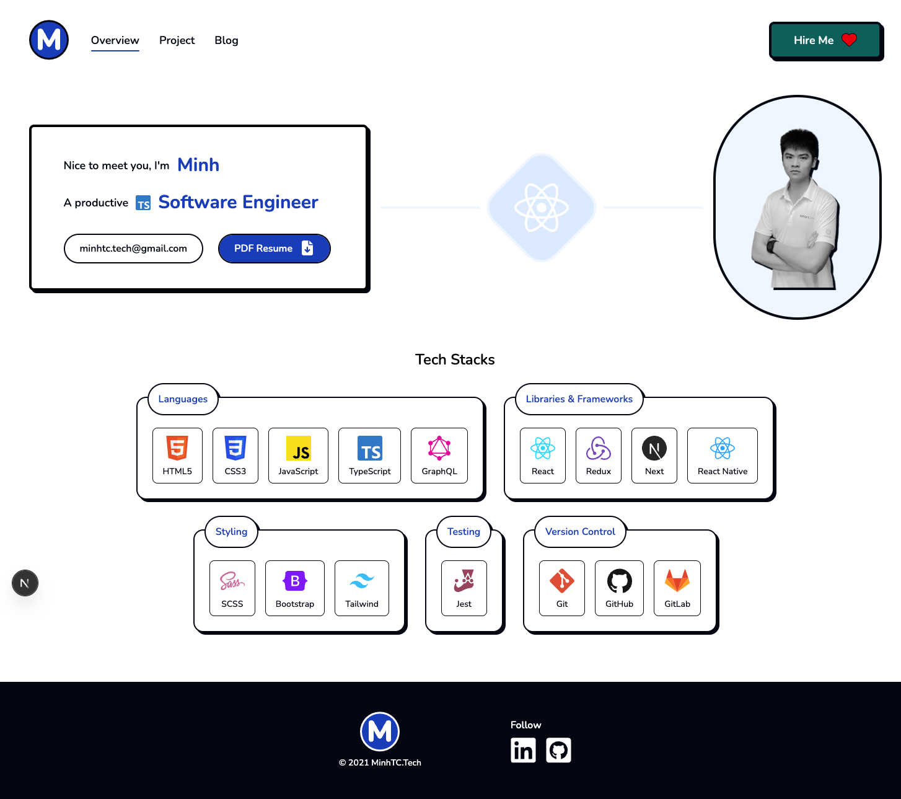

# MinhTC.Tech Portfolio



- This is my personal portfolio website. It showcases my skills, projects, and experience as a Software Engineer.
- Live demo: https://minhtc.tech
- Could you help me give this source a star? I would appreciate it a lot 🥰.

## Technologies 🔧

- [Next.js](https://nextjs.org)
- [TypeScript](https://www.typescriptlang.org)
- [Atomic Design Pattern](https://atomicdesign.bradfrost.com)
- [Tailwind CSS](https://tailwindcss.com)

## Project Structure 🔍

This project is currently in development, the `src` folder structure is as follows:

```
  src/
  - app: Next.js App Router
  - components: Follow Atomic Design Pattern
  - types: Reusable TypeScript Type
  - utils: Reusable Function
```

## Install 💾

1. Clone the repository: `git clone git@github.com:minhtc-tech/portfolio.git`
2. Install the dependencies: `npm install`
3. Start the development server: `npm run dev`
4. Open your browser and visit `http://localhost:3000` to view the portfolio.
